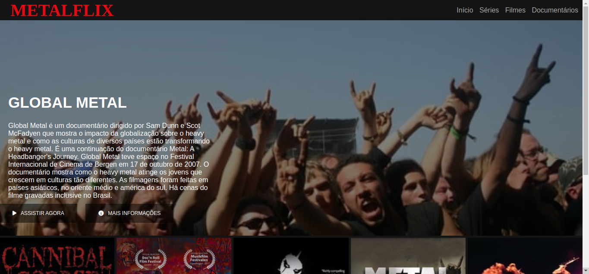
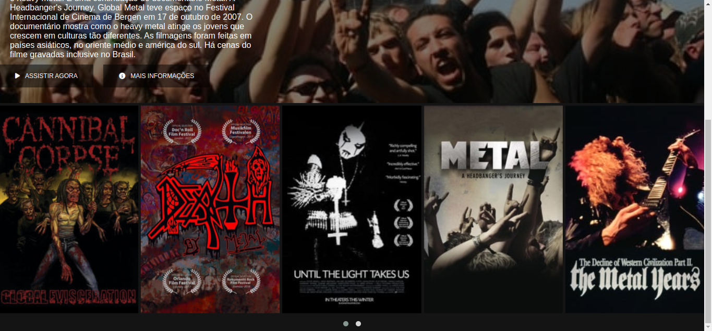

# Projeto de conclusão do módulo HTML5 e CSS3

## Recriando a interface da Netflix

- [x] Construindo a estrutura básica da página.
- [x] Criando o header da página.
- [x] Organizando os elementos do header, utilizando reset CSS e variáveis no CSS.
- [x] Criando containers, inserindo imagem.
- [x] Estilizando os botões e utilizando o Font Awesome.
- [x] Utilizando Media Query para tornar a página responsiva.
- [x] Desafios extras:
- [x] Colocando animação na tag h2 no header com a biblioteca de animações Animate.css(https://animate.style/#documentation) e inserindo novas imagens.

## Imagens da tela construída

